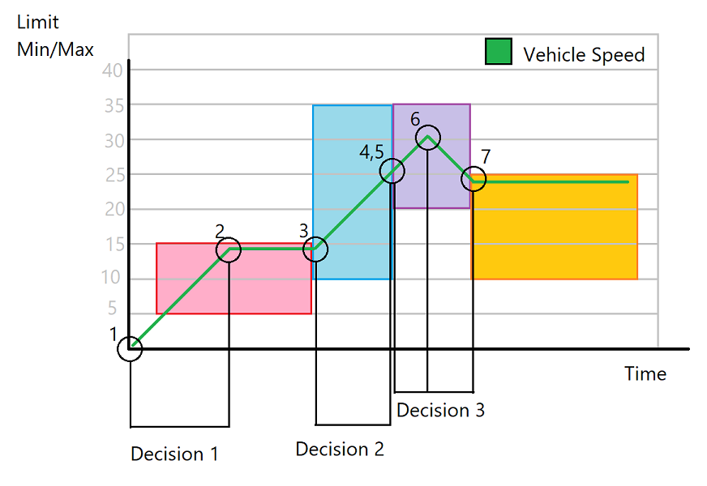

# smachallenge
SMA Tech Challenge project

# Running the app

To run the app without configuration, just compile (or find the zipped exe) and run `AutoAutomobile.exe` - doing so will attempt to execute course 1 with a user named "test@test.com" without any latency compensation.

The application takes 3 parameters which must be supplied in order:
1. The course number, 1, 2 or 3.
2. The username - defaults to "test@test.com"
3. The latency compensation in ms - this defaults to 50ms.

I'll go more into what my thinking was below, but the latency compensation is used to pad / speed up certain events to ensure the API receives signals as the appropriate time. 

# Thoughts

This was a great project, that was much more challenging than I expected. While I was initially concerned that there was no feasible way I would risk riding in this vehicle, by the end of the project I felt that - aside from the neck pain from the near constant .6G acceleration/deceleration, it was at least up for debate.

I would have loved to have more time, but the request for the project left enough to my discretion that I probably would have sunk more time into it than I should have. 

# Overview

I started by reading through the documentation, taking a look at the data models, and then building out a very bare-bones test app, that let me directly issue commands to the Api, like I was controlling a game. Once I understood how the system worked a bit better, I made a plan to maximize speed using the worlds finest deisgn tool, mspaint.

I felt it would be best to avoid relying too heavily on the API for feedback. The first reason being that I didn't want to end up being rate-limited at some critical juncture or create churn for the sake of checking status x/times per second. The second being that such a system would probably rely on some kind of asynchronous polling system and an associated cache, and it seemed a little unnecessary to get at a solution. While I am certainly not signing up to drive with my eyes closed for multiple seconds, I felt that within the confines of the application in question, it made sense.

This model enabled me to trigger a set of actions based solely on Car and Road input.

I isolated the flow into a set of discrete behaviors. Because there was a variable number of outputs, I structured it as an IEnumerable of CarActions. The caller would enumerate the list, with items designed to be executed at a specific time. I ended up wrapping those in an AutoCarAction to this end, which is essentially a CarAction with a delay attached. I wanted to include the idea of "padding" or a "margin" - something that would expand the border of the squares above to ensure that the velocity is fitting safely inside of them - so I added in the latency compensation. It's not used on all requests, but the effect is pronounced.

This pattern made it easy to test, since the bulk of the logic of the app could be derived from a Car and Road. I wrote up several tests for the scenarios I thought of while charting things up, and added more tests as I discovered issues / scenarios.

Once I felt things were in place, I started testing with the API. From there things solidified relatively quickly.

## In Retrospect
I ended up with a list of things left undone:
- Code cleanup
- Rewrite client as Async & concurrently refresh car/road
- Clean up startup sequence, logging and command line arguments
- Validate more inputs, it's far too trusting right now
- Handle Http errors/ network issues
- More tests for other aspects
- Code coverage, etc..

Thanks, I appreciate your consideration.
